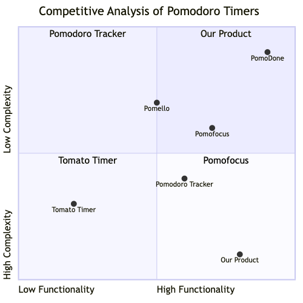
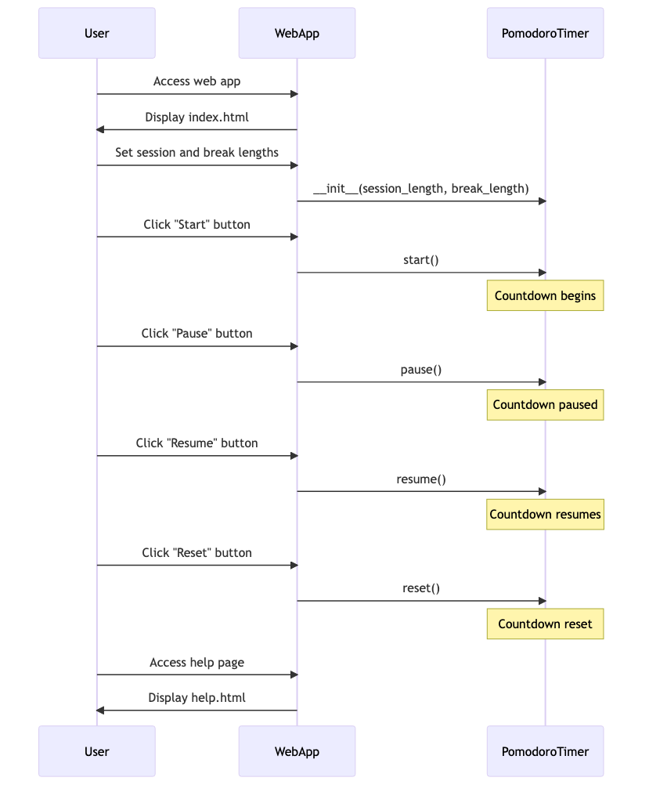

# MetaGPT: The Multi-Role Meta Programming Framework

[English](./README.md) / [中文](./README_CN.md)

## Objective

1. Our ultimate goal is to enable GPT to train, fine-tune, and ultimately, utilize itself, aiming to achieve a level of **self-evolution.**
   1. Once GPT can optimize itself, it will have the capacity to continually improve its own performance without the constant need for manual tuning. This kind of self-evolution enables an **autonomous cycle of growth** where the AI can identify areas for its own improvement, make necessary adjustments, and implement those changes to better achieve its objectives. **It could potentially lead to an exponential growth in the system's capabilities.**
2. Currently, we have managed to enable GPT to work in teams, collaborating to tackle more complex tasks.
   1. For instance, `startup.py` consists of **product manager / architect / project manager / engineer**, it provides the full process of a **software company.**
   2. The team can cooperate and generate **user stories / competetive analysis / requirements / data structures / apis / files etc.**

### Philosophy

The core assets of a software company are three: Executable Code, SOP (Standard Operating Procedures), and Team. 
There is a formula: 

```
Executable Code = SOP(Team)
```

We have practiced this process and expressed the SOP in the form of code, 
and the team itself only used large language models.

## Examples (fully generated by GPT-4)

1. Each column here is a requirement of using the command `python startup.py <requirement>`.
2. By default, an investment of three dollars is made for each example and the program stops once this amount is depleted.
   1. It requires around **$0.2** (GPT-4 api's costs) to generate one example with analysis and design.
   2. It requires around **$2.0** (GPT-4 api's costs) to generate one example with a full project.

|                      | Design an MLOps/LLMOps framework that supports GPT-4 and other LLMs                                     | Design a game like Candy Crush Saga                                                                            | Design a RecSys like Toutiao                                                                                         | Design a roguelike game like NetHack                                                                 | Design a search algorithm framework                                                                                                   | Design a minimal pomodoro timer                                                                                                  |
|----------------------|---------------------------------------------------------------------------------------------------------|----------------------------------------------------------------------------------------------------------------|----------------------------------------------------------------------------------------------------------------------|------------------------------------------------------------------------------------------------------|---------------------------------------------------------------------------------------------------------------------------------------|----------------------------------------------------------------------------------------------------------------------------------|
| Competitive Analysis |  |  |  |  |  |  |
| Data & API Design    |          |          |          |          |          |          |
| Sequence Flow        |                     |                     |                     |                     |                     |                     |


## Installation

```bash
# Step 1: Ensure that Python 3.9+ is installed on your system. You can check this by using:
python --version

# Step 2: Ensure that NPM is installed on your system. You can check this by using:
npm --version

# Step 3: Clone the repository to your local machine, and install it.
git clone https://github.com/geekan/metagpt
cd metagpt
python setup.py install
```

## Configuration

- You can configure your `OPENAI_API_KEY` in `config/key.yaml / config/config.yaml / env`
- Priority order: `config/key.yaml > config/config.yaml > env`

```bash
# Copy the configuration file and make the necessary modifications.
cp config/config.yaml config/key.yaml
```

| Variable Name                              | config/key.yaml                           | env                            |
|--------------------------------------------|-------------------------------------------|--------------------------------|
| OPENAI_API_KEY # Replace with your own key | OPENAI_API_KEY: "sk-..."                  | export OPENAI_API_KEY="sk-..." |
| OPENAI_API_BASE # Optional                            | OPENAI_API_BASE: "https://<YOUR_SITE>/v1" | export OPENAI_API_BASE="https://<YOUR_SITE>/v1"   |

## Tutorial: Initiating a startup

```shell
python startup.py "Write a cli snake game"
```

After running the script, you can find your new project in the `workspace/` directory.

### What's behind? It's a startup fully driven by GPT. You're the investor
| A software company consists of LLM-based roles (For example only)                       | A software company's SOP visualization (For example only)         |
|-----------------------------------------------------------------------------------------|-------------------------------------------------------------------|
|  |  |

### Code walkthrough

```python
from metagpt.software_company import SoftwareCompany
from metagpt.roles import ProjectManager, ProductManager, Architect, Engineer

async def startup(idea: str, investment: str = '$3.0', n_round: int = 5):
    """Run a startup. Be a boss."""
    company = SoftwareCompany()
    company.hire([ProductManager(), Architect(), ProjectManager(), Engineer()])
    company.invest(investment)
    company.start_project(idea)
    await company.run(n_round=n_round)
```

## Tutorial: single role and LLM examples

### The framework support single role as well, here's a simple sales role use case

```python
from metagpt.const import DATA_PATH
from metagpt.document_store import FaissStore
from metagpt.roles import Sales

store = FaissStore(DATA_PATH / 'example.pdf')
role = Sales(profile='Sales', store=store)
result = await role.run('Which facial cleanser is good for oily skin?')
```

### The framework also provide llm interfaces

```python
from metagpt.llm import LLM

llm = LLM()
await llm.aask('hello world')

hello_msg = [{'role': 'user', 'content': 'hello'}]
await llm.acompletion(hello_msg)
```

## Contact Information

If you have any questions or feedback about this project, feel free to reach out to us. We appreciate your input!

- **Email:** alexanderwu@fuzhi.ai
- **GitHub Issues:** For more technical issues, you can also create a new issue in our [GitHub repository](https://github.com/geekan/metagpt/issues).

We aim to respond to all inquiries within 2-3 business days.

